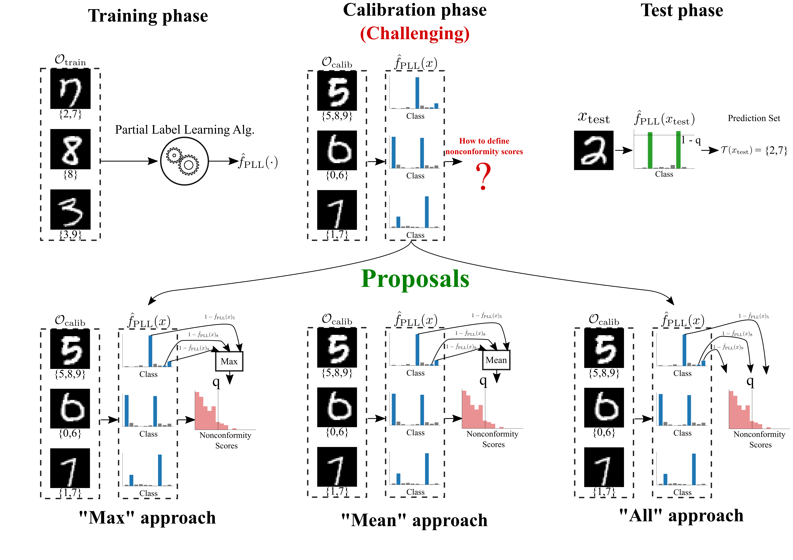

# Conformal Prediction with Partially Labeled Data
This repo has the code for the paper [Conformal Prediction with Partially Labeled Data](https://proceedings.mlr.press/v204/javanmardi23a.html) by Alireza Javanmardi, Yusuf Sale, Paul Hofman, and Eyke Hüllermeier. This paper appears in the 12th Symposium on Conformal and Probabilistic Prediction with Applications (COPA 2023).

In partial label learning, each data instance is ambiguously associated with a set of labels, among which only one is assumed to be the ground truth. Here is an illustration of the challenge of applying conformal prediction to such data and our proposed approaches for tackling it:



## Setup
The file `requirements.txt` has all the required pip packages. The code can be run using the `main.py` file. An example can be found below:
```
python3 main.py -ds mnist -e 100 -noise random -p 1.0 -q 0.1
```

## Citation
If you use this code, please cite the paper
```
@InProceedings{javanmardi2023conformal,
      title={Conformal Prediction with Partially Labeled Data}, 
      author={Alireza Javanmardi and Yusuf Sale and Paul Hofman and Eyke Hüllermeier},
      booktitle={Proceedings of the Twelfth Symposium on Conformal and Probabilistic Prediction with Applications},
      pages={251--266},
      year={2023},
      volume={204},
      series={Proceedings of Machine Learning Research},
      publisher={PMLR},
      pdf={https://proceedings.mlr.press/v204/javanmardi23a/javanmardi23a.pdf},
      url={https://proceedings.mlr.press/v204/javanmardi23a.html}
}
```
